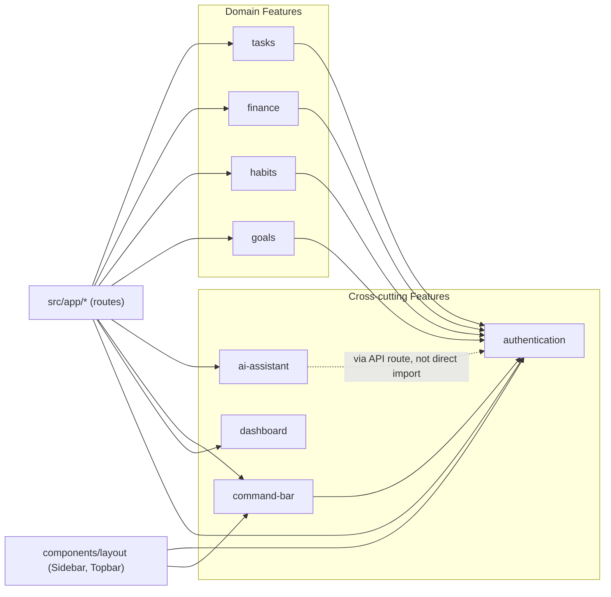

# Semua — Architecture Map

> Snapshot taken immediately after the feature-based refactor (pre Personal/Workspace modules). See [wiki/Changelog.md](wiki/Changelog.md) for prior history and [wiki/Folder-Structure.md](wiki/Folder-Structure.md) for the older (pre-refactor) layout this document supersedes.

---

## 1. Folder Tree & Explanations

```
semua/
├── ARCHITECTURE.md          # this file
├── src/
│   ├── app/                          # Next.js App Router — ROUTES ONLY
│   │   ├── (auth)/login/page.tsx     # /login — public auth page
│   │   ├── (dashboard)/              # authenticated route group, shared layout
│   │   │   ├── layout.tsx            # auth guard + Sidebar + Topbar shell
│   │   │   ├── dashboard/{page.tsx, dashboard-client.tsx}
│   │   │   ├── tasks/{page.tsx, tasks-client.tsx}
│   │   │   ├── finance/{page.tsx, finance-client.tsx}
│   │   │   ├── habits/{page.tsx, habits-client.tsx}
│   │   │   ├── goals/{page.tsx, goals-client.tsx}
│   │   │   ├── settings/{page.tsx, settings-client.tsx}
│   │   │   └── assistant/page.tsx    # AI Agent page
│   │   ├── api/assistant/{route.ts, execute/route.ts}   # Gemini + action execution endpoints
│   │   ├── auth/callback/route.ts    # Supabase OAuth callback
│   │   ├── layout.tsx, global-error.tsx, page.tsx
│   │
│   ├── features/                     # FEATURE-BASED MODULES (the core of this refactor)
│   │   ├── tasks/         {components, hooks, services, types}
│   │   ├── finance/       {components, hooks, services, types}
│   │   ├── habits/        {components, hooks, services, types}
│   │   ├── goals/         {components, hooks, services, types}
│   │   ├── dashboard/     {components}            # StatCard, ai-widget — dashboard-only presentational pieces
│   │   ├── ai-assistant/  {components, lib, lib/tools}  # Gemini client, prompts, response parser, Action Router, per-domain tool executors
│   │   ├── authentication/{services}              # Supabase client/server/middleware builders
│   │   └── command-bar/   {components, lib}        # Cmd+K quick-add: NL parser + legacy direct-insert handler
│   │
│   ├── components/                   # TRULY CROSS-FEATURE, presentational-only
│   │   ├── ui/                       # shadcn primitives (button, dialog, select, ...) — never hand-edited
│   │   ├── layout/                   # Sidebar, Topbar, Providers — app shell, used by every route
│   │   └── landing/                  # Public landing page sections
│   │
│   ├── constants/                    # Shared, single-source-of-truth values
│   │   ├── categories.ts             # expense/income categories + currency symbol + guessCategory()
│   │   ├── habit-emoji.ts            # merged emoji keyword map + guessHabitEmoji()
│   │   ├── priority.ts               # task priority options + color classes
│   │   └── routes.ts                 # sidebar NAV_ITEMS
│   │
│   ├── utils/                        # Shared, pure helper functions
│   │   ├── format-currency.ts        # formatCurrency(amount, decimals?)
│   │   ├── date-range.ts             # getMonthRange(date?)
│   │   └── find-by-name.ts           # generic Supabase fuzzy-lookup-by-name helper
│   │
│   ├── lib/                          # Cross-cutting, framework-level utilities (NOT feature-specific)
│   │   ├── utils.ts                  # cn() — shadcn's required Tailwind class merger
│   │   ├── validations.ts            # Zod schemas (taskSchema, transactionSchema, habitSchema, goalSchema) — shared by every feature's forms
│   │   └── ai-suggestions.ts         # rule-based dashboard suggestion engine (heuristics, not LLM)
│   │
│   ├── types/index.ts                # ONLY truly global types: User, AISuggestion, DashboardStats
│   └── proxy.ts                      # Next.js middleware entry point (fixed path, required by framework)
│
├── public/bg.jpg                     # dashboard background image
└── wiki/                             # GitHub Wiki documentation (15 pages)
```

### Why this shape

- **`features/*`** is the unit of future growth. Every new module (Personal, Workspace, Tax, Calendar, Documents, Learning, Projects) gets its own `features/<name>/{components,hooks,services,types,constants}` folder and nothing else needs to change.
- **`components/`** is reserved for things with zero feature-specific knowledge — shadcn primitives and the app shell. If a component imports a feature hook or service, it belongs inside that feature's `components/`, not here.
- **`constants/` and `utils/`** hold values and pure functions used by *more than one* feature. Single-feature constants live inside that feature folder instead (e.g. task priority colors could have stayed feature-local, but were promoted here since other future modules — e.g. Projects — will likely need priority levels too).
- **`lib/`** is intentionally small and is for things tied to the framework/build toolchain (`cn()` is a shadcn CLI convention) or truly used everywhere (`validations.ts` — every feature's create/edit form imports it).

---

## 2. Dependency Graph

Arrows mean "imports from." Built by grepping every `@/features/*` import across the tree.



### Rules this graph reveals (and should stay true going forward)

1. **`authentication` is the only feature every other feature is allowed to depend on.** It has zero dependencies itself — it's the foundation (Supabase client/server/middleware builders).
2. **`tasks`, `finance`, `habits`, `goals` never import each other.** Each is fully self-contained (own hook, service, types, components). This is what makes them safe to delete or replace independently.
3. **`ai-assistant` does not import other domain features directly.** It receives an already-authenticated Supabase client inside the API route (`src/app/api/assistant/*`) and talks to `tasks`/`finance`/`habits`/`goals` tables only through its own `lib/tools/*.ts` executors — it does NOT call into `features/tasks/services/*`. This is intentional: the AI tool executors have different validation/fuzzy-lookup needs than the UI hooks, so they stay separate rather than sharing a service layer. **This is the one place a future "shared domain service" consolidation could pay off** (see Technical Debt).
4. **`command-bar` depends on `authentication` only** — its legacy `commandHandler.ts` does its own direct Supabase inserts rather than calling feature services, mirroring point 3.
5. **`dashboard`** has no feature dependencies — it only holds presentational components (`StatCard`, `ai-widget`) that receive data as props from `dashboard-client.tsx`, which itself pulls from `tasks`/`finance`/`habits`/`goals` hooks at the route level.

---

## 3. Technical Debt Report

| # | Item | Where | Severity | Why it exists / why it's not fixed yet |
|---|------|-------|----------|------------------------------------------|
| 1 | `ai-assistant/lib/tools/*.ts` has 11+ repeated "find record by name" Supabase lookups instead of using `utils/find-by-name.ts` | `features/ai-assistant/lib/tools/{tasks,finance,habits,goals}.ts` | Low-Medium | The shared `findByName()` util normalizes error message text (e.g. lowercase singular table name); each tool's current error message has slightly different, hand-tuned wording (`"Task X not found"` vs others). Wiring it in would be a user-visible string change, which violates the "no behavior change" constraint of this refactor. **Action:** normalize error message format intentionally in a follow-up PR, then swap all 11 call sites to `findByName()`. |
| 2 | `command-bar`'s legacy `commandHandler.ts` duplicates business logic already in `ai-assistant/lib/tools/*` | `features/command-bar/lib/commandHandler.ts` | Medium | Two independent code paths exist for "create a task/expense/habit/goal from text": the Cmd+K quick-add (rule-based parser → direct insert) and the AI Agent (Gemini → Action Router → tool executor). They evolved separately and were kept separate during this refactor on purpose. **Action:** before adding more trackers, decide whether Quick Add should be rebuilt on top of the Action Router (one source of truth) or kept as an intentionally-simpler fallback path. |
| 3 | `lib/ai-suggestions.ts` (rule-based dashboard suggestions) duplicates logic conceptually similar to `ai-assistant/lib/actionRouter.ts`'s `generateInsights()` | `src/lib/ai-suggestions.ts`, `features/ai-assistant/lib/actionRouter.ts` | Low | Both compute "things worth telling the user" from the same tables, with different heuristics (one heuristic/local, one server-side for the AI Agent's `generate_insights` action). Not unified because they serve different UI surfaces (dashboard widget vs. chat response) with different freshness/format needs. **Action:** consider a single `insights` domain service feeding both once a Personal/Workspace module needs the same pattern. |
| 4 | No automated test suite | whole repo | Medium-High | Pre-existing, not introduced by this refactor. Verification during the refactor relied on `npm run build` (type safety) + manual route walkthrough + verbatim-copy discipline. **Action:** as features stabilize post-refactor, add unit tests for `services/*.ts` (pure, easy to test — they're now isolated from React) and `constants`/`utils` (pure functions, no excuse not to test these first). |
| 5 | `react-hooks/set-state-in-effect` lint warnings in `CommandBar.tsx` | `features/command-bar/components/CommandBar.tsx:95,104` | Low | Pre-existing (confirmed via `git show HEAD` — not introduced by the move). Calling `setState` synchronously inside `useEffect` for the real-time parse preview and the focus-on-open behavior. Functionally fine today but flagged by React Compiler. **Action:** low priority, but a good first test case for #4 above before touching the logic. |
| 6 | Unescaped quote/apostrophe characters in JSX (`react/no-unescaped-entities`) | `landing-page.tsx`, `CommandBar.tsx`, `dashboard-client.tsx` | Cosmetic | Pre-existing lint noise, no runtime impact. Cheap to fix opportunistically next time those files are touched. |
| 7 | No dark mode despite CSS variables already supporting it | `src/app/globals.css` (`.dark` class defined, unused) | Low | Documented as a known gap in [wiki/UI-Design-System.md](wiki/UI-Design-System.md); unrelated to this refactor but worth tracking here since Personal/Workspace modules will multiply the UI surface that eventually needs theming. |
| 8 | No rate limiting on `/api/assistant*` routes | `src/app/api/assistant/*` | Medium | Documented in [wiki/Security.md](wiki/Security.md); becomes more important as more AI-driven modules are added (more attack surface, more cost exposure per user). |

---

## 4. Performance Report

### What changed (refactor-driven)

| Area | Before | After | Effect |
|------|--------|-------|--------|
| Hook → DB coupling | Hooks called `.from(...)` directly inline | Hooks call named `service.ts` functions | **Neutral on runtime perf** — same query, same network call. Benefit is testability/maintainability, not speed. |
| Component size | 5 client pages averaging ~270 lines with all dialogs/cards inlined | Dialogs/cards extracted to dedicated files, pages now ~150-190 lines | **Likely small positive** — smaller component bodies mean React can bail out of re-rendering unrelated JSX trees more easily when state changes inside an extracted child, since each extracted component now has its own render boundary. Not yet measured with React DevTools Profiler. |
| Currency/date formatting | Recomputed inline with `toFixed()`/`date-fns` calls scattered across 5 files | Centralized in `utils/format-currency.ts`, `utils/date-range.ts` | **Neutral** — same computation cost, just deduplicated source. |
| Bundle size | N/A (reorg doesn't add/remove dependencies) | N/A | **No change** — zero new npm packages added; this was a structural refactor only. |

### Not addressed in this pass (flagged, not fixed — would be behavior/perf-tuning, out of scope for a "no functional change" refactor)

- **No memoization audit performed.** None of the extracted components (`TaskCard`, `TransactionDialog`, `GoalDialog`, `HabitDialog`, etc.) were wrapped in `React.memo`, and none of the list-rendering call sites (`tasks.map(...)`, etc.) were checked for unnecessary re-renders. Worth a dedicated profiling pass before Personal/Workspace adds significantly more list-heavy UI.
- **No code-splitting / dynamic import changes.** `AssistantPanel`, `CommandBar`, and chart-heavy `finance-client.tsx` (Recharts) are still bundled into their route chunks normally. Recharts in particular is a reasonable `next/dynamic` candidate if Finance's initial load time becomes a concern.
- **No Supabase query optimization.** All queries still `select('*')` rather than selecting only needed columns; this was true before the refactor and stayed true (changing it would alter the data shape returned to hooks — out of scope for "same behavior").
- **Build time:** `npm run build` completes in ~11-13s compile + ~12-15s typecheck on this machine post-refactor — comparable to pre-refactor (not separately benchmarked before/after, since the file count change alone wouldn't be expected to move this number meaningfully at this codebase size).

### Recommendation before Personal/Workspace land

Do a real profiling pass (React DevTools Profiler + Lighthouse) once 1-2 more feature modules exist, rather than guessing now — premature optimization here would fight the "no behavior change" constraint of this refactor. The structural work in this pass (small components, isolated services) is what makes that future profiling pass *actionable* (you can now memoize one component at a time without untangling a 300-line file first).

---

## 5. Using This Document for New Modules

When adding **Personal**, **Workspace**, or any future module:

1. Create `src/features/<module>/{components,hooks,services,types,constants}` — only the subfolders you actually need.
2. The new feature may depend on `authentication` and on shared `constants/`/`utils/`/`lib/`. It should **not** depend on `tasks`/`finance`/`habits`/`goals`/`ai-assistant` directly — if cross-feature data sharing is needed, surface it through a route-level composition (like `dashboard-client.tsx` does today) rather than a feature-to-feature import.
3. If the new module needs AI actions, add executors under `features/ai-assistant/lib/tools/<module>.ts` and register them in `actionRouter.ts` + the system prompt in `prompts.ts` — do not create a second AI integration path.
4. Reuse `formatCurrency`, `getMonthRange`, `findByName` (now safe to adopt — new modules won't carry legacy error-text constraints), and the `constants/priority.ts`-style pattern for any new shared enums.
