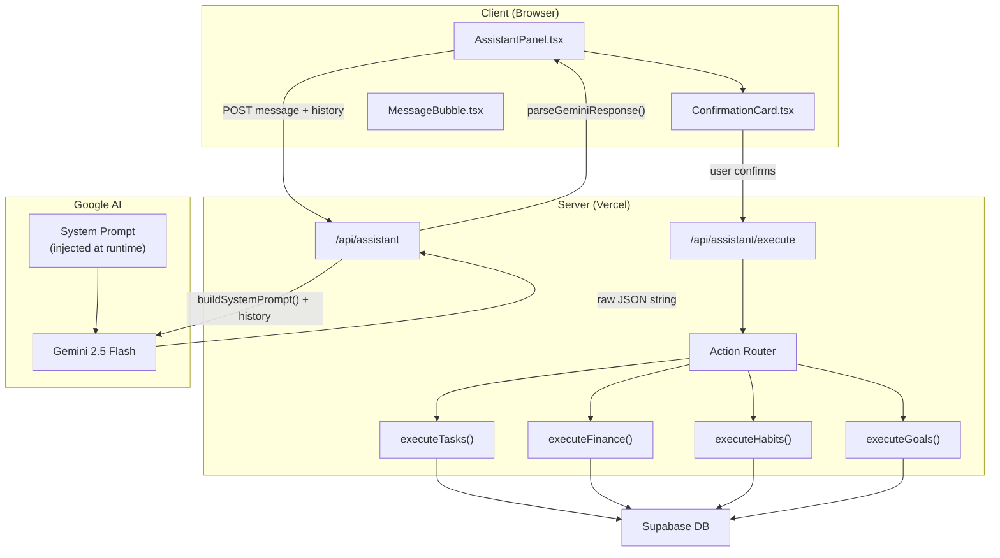
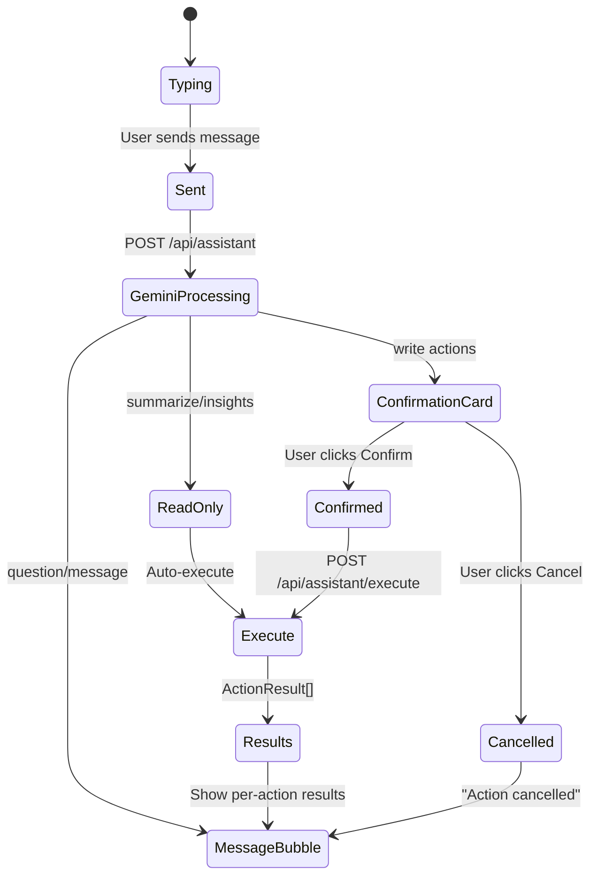

# AI Agent

> Natural language productivity powered by Gemini 2.5 Flash.

**→ [Home](Home) · [API](API) · [Architecture](Architecture) · [Trackers](Trackers)**

---

## Table of Contents

- [Why an AI Agent?](#why-an-ai-agent)
- [Why Gemini 2.5 Flash?](#why-gemini-25-flash)
- [Architecture](#architecture)
- [System Prompt Design](#system-prompt-design)
- [Action Types](#action-types)
- [Action Router](#action-router)
- [Tool Executors](#tool-executors)
- [Confirmation Flow](#confirmation-flow)
- [Conversation Memory](#conversation-memory)
- [Natural Language Examples](#natural-language-examples)
- [Security Model](#security-model)
- [Future Upgrades](#future-upgrades)

---

## Why an AI Agent?

A traditional chatbot responds with text. An **AI Action Agent** responds with *structured actions* that actually change your data.

| Chatbot | AI Action Agent (Semua) |
|---------|------------------------|
| "Sure, I'll note that" | Actually inserts the expense row |
| Requires you to click away | Executes in the chat itself |
| Stateless, forgets context | Maintains conversation history |
| Can only suggest | Can create, update, delete, summarize |

The friction of productivity apps is data entry. Every click removed is a win. Typing *"lunch RM15"* and pressing Enter is faster than opening Finance → clicking Add → filling 4 fields → clicking Save.

---

## Why Gemini 2.5 Flash?

| Criterion | Decision |
|-----------|----------|
| Speed | Flash tier is optimized for low latency — essential for chat UX |
| JSON output reliability | Gemini 2.5 Flash follows structured output instructions consistently |
| Cost | Flash is significantly cheaper than Pro for high-frequency requests |
| Privacy | Google AI does not train on API data with zero data retention config |
| SDK | `@google/genai` is stable and well-typed |

**Deliberate exclusions:** OpenAI, Anthropic Claude, LangChain, Vercel AI SDK. Semua uses `@google/genai` directly to avoid vendor lock-in abstraction layers and keep the implementation transparent.

---

## Architecture



**Key principle:** Gemini never touches the database. It only returns intent as JSON. All writes are validated and executed server-side by the Action Router.

---

## System Prompt Design

The system prompt is built at **request time** (not hardcoded) to inject live date context:

```typescript
// src/lib/ai/prompts.ts
export function buildSystemPrompt(): string {
  const today = format(new Date(), 'yyyy-MM-dd')
  const tomorrow = format(addDays(new Date(), 1), 'yyyy-MM-dd')
  const friday = format(nextFriday(new Date()), 'yyyy-MM-dd')
  const monday = format(nextMonday(new Date()), 'yyyy-MM-dd')

  return `You are Semua AI, an intelligent action planner.
Today is ${format(new Date(), 'EEEE')}, ${today}.
tomorrow=${tomorrow}, next Friday=${friday}, next Monday=${monday}.
Currency is Malaysian Ringgit (RM).

Return ONLY raw JSON. No markdown. No explanation.
...`
}
```

### Prompt Philosophy

- **Raw JSON only** — no markdown fences, no explanation text, just `{ ... }`
- **Relative dates resolved** — "next Friday" → exact date string injected at call time
- **Currency context** — Malaysian Ringgit default, extracts from "RM15", "rm 50", "15 ringgit"
- **Single responsibility** — Gemini classifies intent, humans confirm, server executes
- **One question at a time** — if data is missing, ask exactly one short follow-up

---

## Action Types

Gemini can return three response types:

### 1. `actions` — One or more actions to execute

```json
{
  "type": "actions",
  "actions": [
    {
      "type": "create_expense",
      "data": {
        "title": "Lunch",
        "amount": 15,
        "category": "Food",
        "date": "2025-06-30"
      }
    }
  ]
}
```

### 2. `question` — Clarification needed

```json
{
  "type": "question",
  "question": "What category should I use for this expense?"
}
```

### 3. `message` — Informational response

```json
{
  "type": "message",
  "message": "You have 3 tasks due today and spent RM420 this month."
}
```

### Full Action Catalogue

| Action Type | Description |
|-------------|-------------|
| `create_task` | Create a new task |
| `complete_task` | Mark task as completed (by name) |
| `update_task` | Update task fields |
| `delete_task` | Delete a task |
| `create_expense` | Log an expense |
| `create_income` | Log an income entry |
| `update_transaction` | Update a transaction |
| `delete_transaction` | Delete a transaction |
| `create_habit` | Create a new habit |
| `complete_habit` | Log habit completion for today |
| `update_habit` | Update habit settings |
| `delete_habit` | Delete a habit |
| `create_goal` | Create a new goal |
| `update_goal_progress` | Update goal progress |
| `complete_goal` | Mark goal as completed |
| `delete_goal` | Delete a goal |
| `summarize_dashboard` | Fetch and summarize all tracker data |
| `generate_insights` | Generate personalized insights |

---

## Action Router

`src/lib/router/actionRouter.ts` routes each action to the correct tool executor:

```typescript
for (const action of actions) {
  if (action.type.startsWith('create_task') || ...) {
    message = await executeTasks(action, supabase, userId)
  } else if (['create_expense', 'create_income', ...].includes(action.type)) {
    message = await executeFinance(action, supabase, userId)
  }
  // ... etc
}
```

Each action runs sequentially. Errors are caught per-action and returned as `{ success: false, message }` — not thrown globally. This means a multi-action request can partially succeed.

---

## Tool Executors

Each executor validates inputs before touching the database:

### Find-by-name pattern

For `complete_task`, `complete_habit`, etc. — Gemini returns a name string, not an ID. The executor does a fuzzy `ilike` lookup:

```typescript
const { data: tasks } = await supabase
  .from('tasks')
  .select('id, title')
  .eq('user_id', userId)
  .ilike('title', `%${d.name}%`)
  .limit(1)

if (!tasks?.length) throw new Error(`Task "${d.name}" not found`)
```

### Duplicate prevention (habits)

```typescript
const { data: existing } = await supabase
  .from('habit_logs')
  .select('id')
  .eq('habit_id', habits[0].id)
  .eq('date', today)
  .limit(1)

if (existing?.length) return `Habit already completed today`
```

---

## Confirmation Flow

Write actions require explicit user confirmation before execution:



**Destructive actions** (delete_*) show a red confirmation card with "Confirm Delete" button.

---

## Conversation Memory

Within a session, conversation history is maintained in React state:

```typescript
const [geminiHistory, setGeminiHistory] = useState<HistoryItem[]>([])

// After each exchange:
setGeminiHistory(prev => [
  ...prev,
  { role: 'user', parts: [{ text: message }] },
  { role: 'model', parts: [{ text: rawResponse }] },
])
```

This is passed to every Gemini call so it can reference prior context ("change the task I just created to high priority").

**Limitation:** History is lost on page refresh. Persistent memory is a v2.0 feature.

---

## Natural Language Examples

| User says | Action created |
|-----------|---------------|
| "Add lunch expense RM15" | `create_expense` · RM15 · Food |
| "I completed my gym habit" | `complete_habit` · name: "gym" |
| "Create task review proposal due Friday" | `create_task` · due: next Friday |
| "How am I doing this month?" | `summarize_dashboard` |
| "Add goal: read 12 books" | `create_goal` · target: 12 |
| "Delete the lunch expense" | `delete_transaction` · name: "lunch" |
| "Mark gym task done" | `complete_task` · name: "gym" |
| "Give me insights" | `generate_insights` |

---

## Security Model

| Concern | Mitigation |
|---------|-----------|
| API key exposure | `GEMINI_API_KEY` is server-only, never in client bundle |
| Prompt injection | System prompt is built server-side; user input is last in history |
| Unauthorized writes | Action Router uses authenticated Supabase client with RLS |
| Gemini hallucinating IDs | Executor does DB lookup by name; never trusts Gemini-provided IDs |
| Mass deletion | Confirmation card required for all destructive actions |

---

## Future Upgrades

- [ ] Persistent conversation memory (database-backed)
- [ ] Proactive suggestions push ("You haven't logged your gym habit in 3 days")
- [ ] Voice input (Web Speech API)
- [ ] Multi-model fallback (Gemini → Claude)
- [ ] AI weekly review generation
- [ ] Pattern detection ("You overspend on Fridays")
- [ ] Smart task scheduling ("When should I do this given my workload?")
- [ ] Calendar integration awareness

---

*See also: [API](API) · [Architecture](Architecture) · [Security](Security)*
