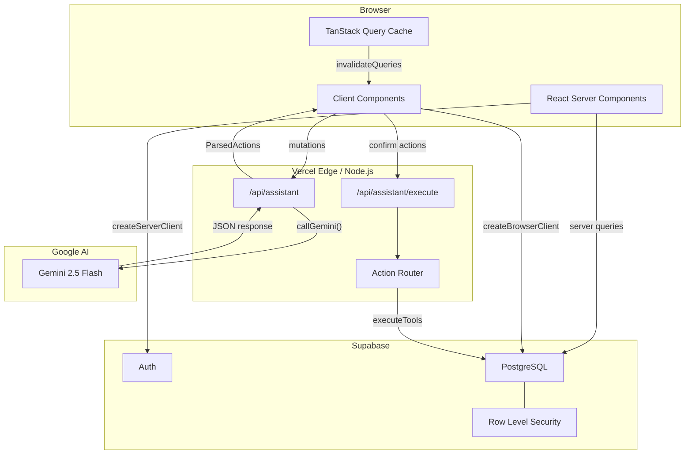
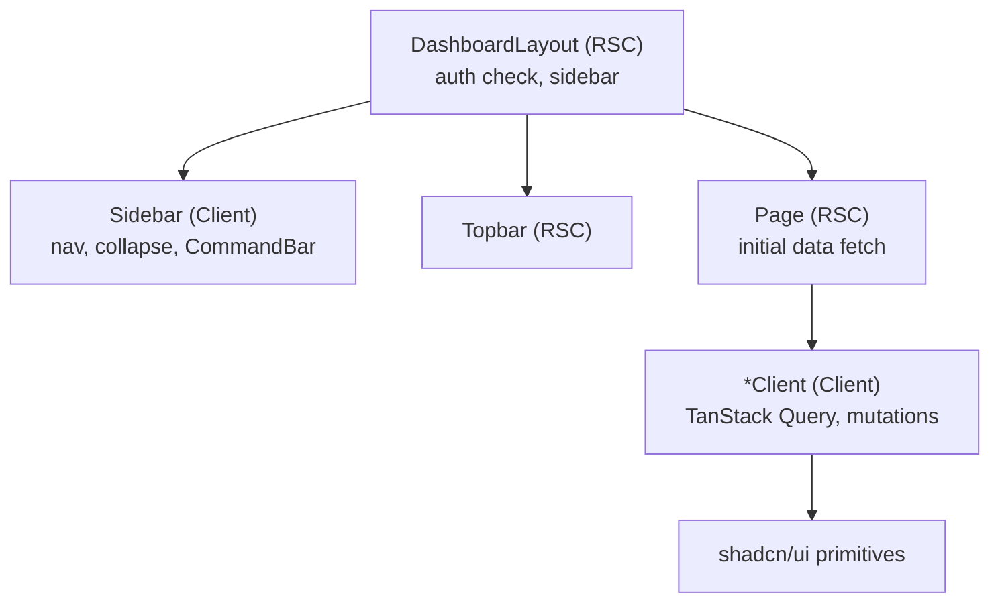
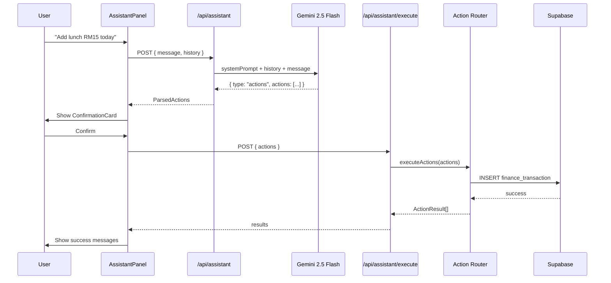
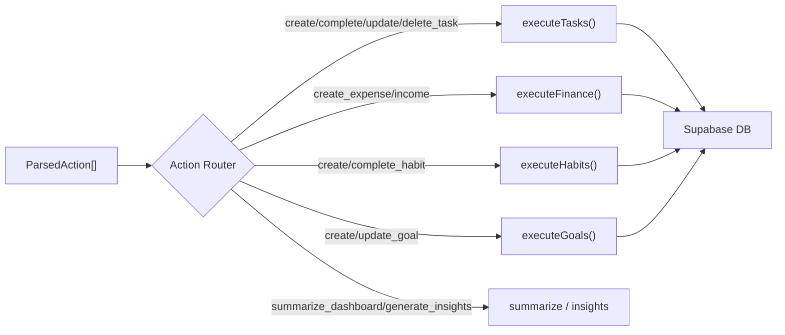
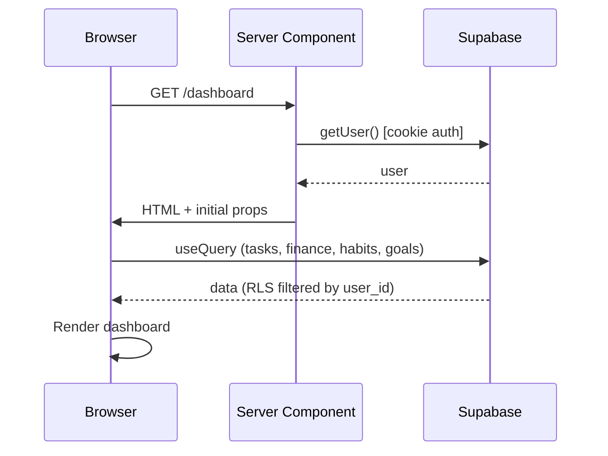
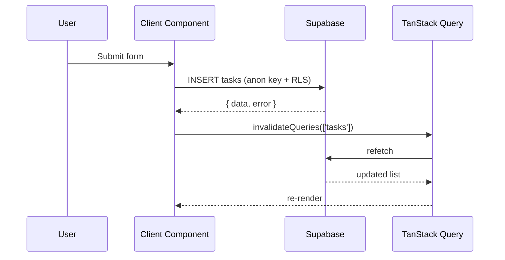
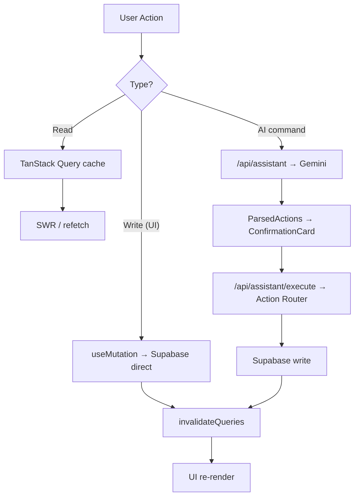
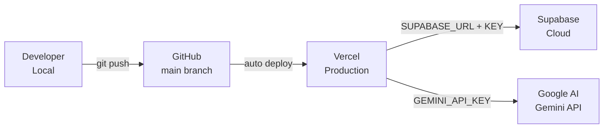

# Architecture

> System design, data flow, and component relationships.

**→ [Home](Home) · [Database](Database) · [API](API) · [Folder Structure](Folder-Structure)**

---

## Table of Contents

- [Overview](#overview)
- [Frontend Architecture](#frontend-architecture)
- [Backend Architecture](#backend-architecture)
- [AI Agent Architecture](#ai-agent-architecture)
- [Data Flow](#data-flow)
- [Request Lifecycle](#request-lifecycle)
- [Deployment Architecture](#deployment-architecture)

---

## Overview

Semua is a **full-stack Next.js application** using the App Router. The architecture separates concerns into:

- **React Server Components (RSC)** for initial data fetching and auth checks
- **Client Components** for interactive UI with TanStack Query for caching
- **Server-side API Routes** for all mutations and AI calls
- **Supabase** as the single source of truth for data and auth
- **Gemini** as a stateless intent classifier (never touches the DB directly)



---

## Frontend Architecture

### Rendering Strategy

| Route | Strategy | Reason |
|-------|----------|--------|
| `/` (landing) | SSG | Static, no auth needed |
| `/login` | SSG | Static form |
| `/(dashboard)/*` | SSR → RSC | Auth check server-side |
| Client components | CSR with TanStack Query | Interactivity + caching |

### Component Hierarchy



### State Management

- **Server state** → TanStack Query (`useQuery`, `useMutation`)
- **Local UI state** → React `useState` (modals, forms, filters)
- **Auth state** → Supabase session (server-side cookie)
- **No global store** (Redux, Zustand) — not needed at this scale

---

## Backend Architecture

### API Routes

All mutations and AI calls go through Next.js API routes (Server Components or Route Handlers). Direct Supabase writes from the client use the anon key with RLS enforcing user isolation.

```
app/
  api/
    assistant/
      route.ts         → POST /api/assistant (Gemini call)
      execute/
        route.ts       → POST /api/assistant/execute (action execution)
```

### Supabase Client Pattern

```typescript
// Server components / API routes
import { createServerClient } from '@supabase/ssr'
const supabase = createServerClient(url, key, { cookies })

// Client components
import { createBrowserClient } from '@supabase/ssr'
const supabase = createBrowserClient(url, key)
```

---

## AI Agent Architecture

The AI Agent is the most complex subsystem. Gemini's only job is **intent classification** — it never reads from or writes to the database.



### Action Router Flow



---

## Data Flow

### Read Flow (Dashboard load)



### Write Flow (Create task)



---

## Request Lifecycle

Every user interaction follows this pattern:



---

## Deployment Architecture



Vercel handles:
- Build (`next build`)
- Edge/Node.js serverless functions
- Static asset CDN
- Environment variable injection

---

*See also: [Database](Database) · [AI Assistant](AI-Assistant) · [API](API)*
