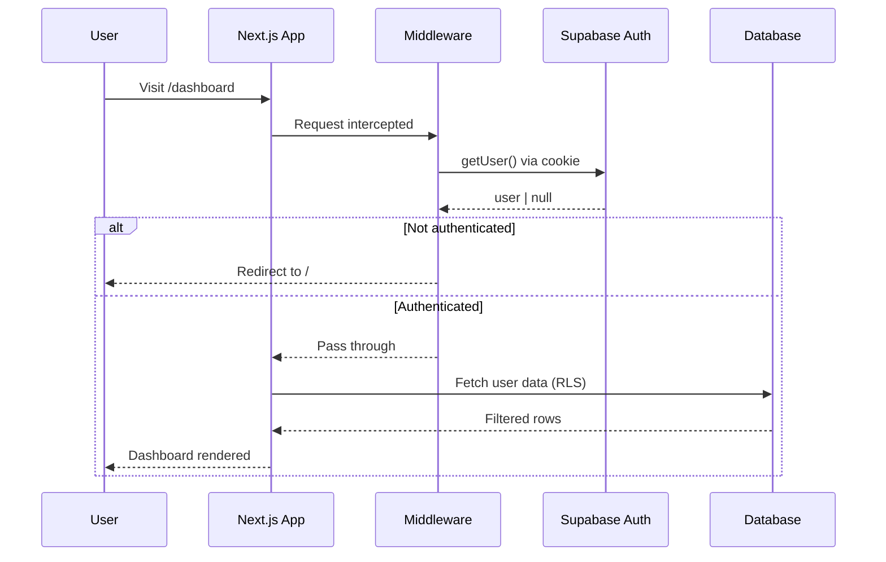
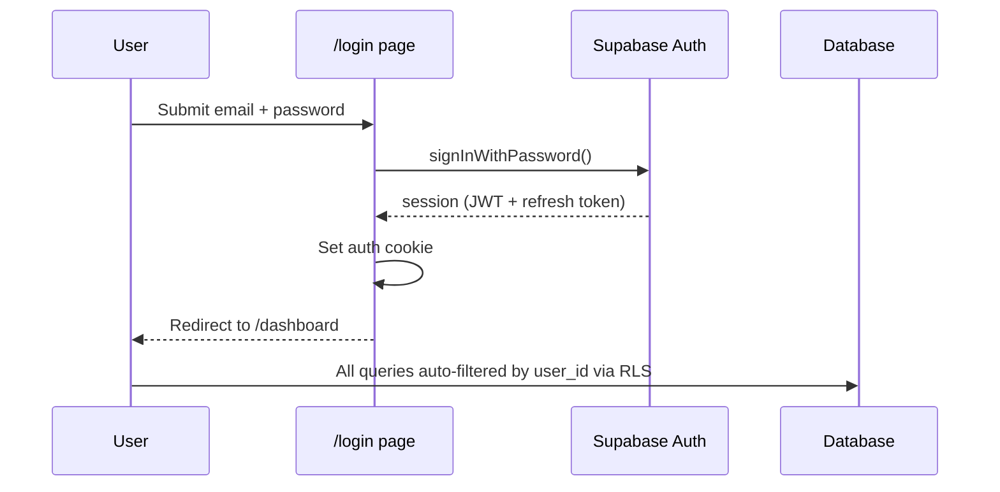

# Authentication

> Powered by Supabase Auth with SSR cookie-based sessions.

**→ [Home](Home) · [Security](Security) · [Database](Database)**

---

## Table of Contents

- [Overview](#overview)
- [Auth Flow](#auth-flow)
- [Supabase SSR Setup](#supabase-ssr-setup)
- [Protected Routes](#protected-routes)
- [Session Management](#session-management)
- [OAuth Providers](#oauth-providers)
- [Security Considerations](#security-considerations)
- [Future Improvements](#future-improvements)

---

## Overview

Semua uses **Supabase Auth** with the `@supabase/ssr` package for Next.js App Router compatibility. Sessions are stored as HTTP-only cookies and refreshed automatically.

| Feature | Status |
|---------|--------|
| Email/Password | ✅ Live |
| Google OAuth | 📋 Planned (v1.0) |
| Apple Sign-In | 📋 Planned (v1.0) |
| Magic Link | 📋 Planned |

---

## Auth Flow



### Login Flow



---

## Supabase SSR Setup

### Server Client (API routes, RSC)

```typescript
// src/lib/supabase/server.ts
import { createServerClient } from '@supabase/ssr'
import { cookies } from 'next/headers'

export async function createClient() {
  const cookieStore = await cookies()
  return createServerClient(
    process.env.NEXT_PUBLIC_SUPABASE_URL!,
    process.env.NEXT_PUBLIC_SUPABASE_ANON_KEY!,
    {
      cookies: {
        getAll() { return cookieStore.getAll() },
        setAll(cookiesToSet) {
          cookiesToSet.forEach(({ name, value, options }) =>
            cookieStore.set(name, value, options)
          )
        },
      },
    }
  )
}
```

### Browser Client (Client Components)

```typescript
// src/lib/supabase/client.ts
import { createBrowserClient } from '@supabase/ssr'

export function createClient() {
  return createBrowserClient(
    process.env.NEXT_PUBLIC_SUPABASE_URL!,
    process.env.NEXT_PUBLIC_SUPABASE_ANON_KEY!
  )
}
```

---

## Protected Routes

### Dashboard Layout Guard

Every dashboard page is protected at the layout level:

```typescript
// src/app/(dashboard)/layout.tsx
export default async function DashboardLayout({ children }) {
  const supabase = await createClient()
  const { data: { user } } = await supabase.auth.getUser()

  if (!user) redirect('/')

  return (
    <div className="flex h-screen overflow-hidden">
      <Sidebar />
      <div className="flex-1 flex flex-col overflow-hidden">
        {children}
      </div>
    </div>
  )
}
```

This is the **primary auth gate**. All routes under `/(dashboard)/` inherit this check.

### Middleware (optional future)

For performance, middleware can check auth before rendering any component:

```typescript
// middleware.ts (future)
export async function middleware(request: NextRequest) {
  const { supabase, response } = createMiddlewareClient(request)
  const { data: { session } } = await supabase.auth.getSession()

  if (!session && request.nextUrl.pathname.startsWith('/dashboard')) {
    return NextResponse.redirect(new URL('/', request.url))
  }
  return response
}
```

---

## Session Management

### How Sessions Work

1. On login, Supabase issues a **JWT** (access token, 1 hour TTL) + **refresh token** (long-lived)
2. `@supabase/ssr` stores both as **HTTP-only cookies** (not accessible to JavaScript)
3. On each server request, the SDK reads the cookie, verifies the JWT, and auto-refreshes if expired
4. The JWT contains `sub` (user ID) used by RLS policies as `auth.uid()`

### Logout

```typescript
const handleLogout = async () => {
  const supabase = createClient()
  await supabase.auth.signOut()
  router.push('/')
}
```

`signOut()` clears the session cookie server-side and invalidates the refresh token.

---

## OAuth Providers

### Google OAuth (Planned — v1.0)

```typescript
// Future implementation
const signInWithGoogle = async () => {
  const supabase = createClient()
  await supabase.auth.signInWithOAuth({
    provider: 'google',
    options: {
      redirectTo: `${window.location.origin}/auth/callback`,
    },
  })
}
```

**Setup in Supabase Dashboard:**
1. Authentication → Providers → Google → Enable
2. Add `GOOGLE_CLIENT_ID` and `GOOGLE_CLIENT_SECRET`
3. Add callback URL to Google OAuth consent screen

### Apple Sign-In (Planned — v1.0)

Requires Apple Developer account and SIWA entitlement. Similar pattern to Google OAuth.

---

## Security Considerations

| Concern | Mitigation |
|---------|-----------|
| Token storage | HTTP-only cookies (no XSS access) |
| CSRF | SameSite cookie policy |
| JWT expiry | 1 hour TTL, auto-refresh via `@supabase/ssr` |
| Row isolation | RLS on every table — `auth.uid() = user_id` |
| API key exposure | `anon` key is safe to expose; RLS prevents data leakage |
| Server-side secrets | `GEMINI_API_KEY` server-only, never in client bundle |

---

## Future Improvements

- [ ] Google OAuth (v1.0)
- [ ] Apple Sign-In (v1.0)
- [ ] Magic link (passwordless) login
- [ ] MFA / TOTP support
- [ ] Session activity log
- [ ] Account deletion with data purge
- [ ] Email change with verification

---

*See also: [Security](Security) · [Deployment](Deployment)*
