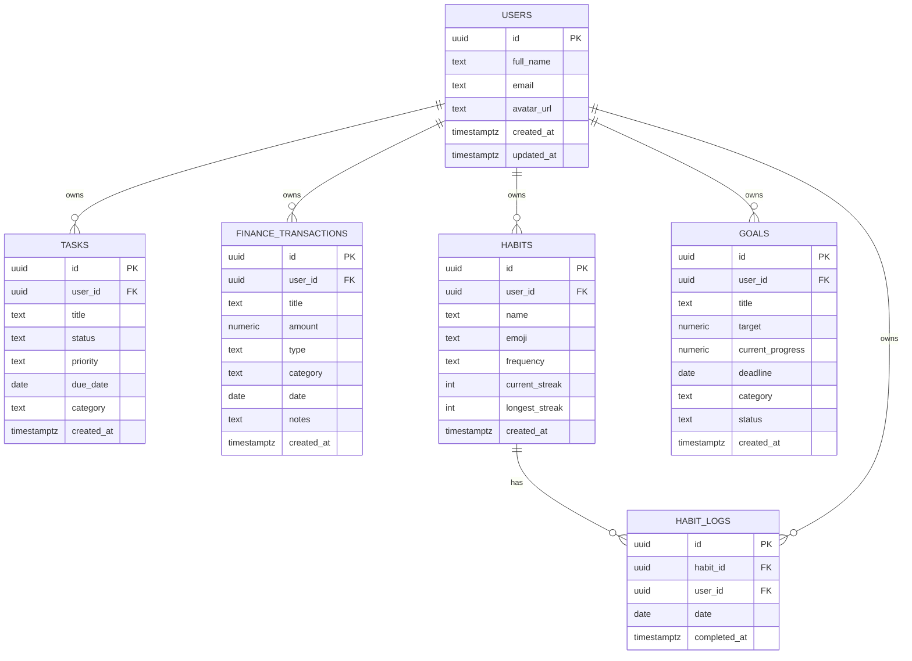

# Database

> PostgreSQL hosted on Supabase. All tables use Row Level Security (RLS).

**→ [Home](Home) · [Architecture](Architecture) · [Security](Security)**

---

## Table of Contents

- [Overview](#overview)
- [Entity Relationship Diagram](#entity-relationship-diagram)
- [Tables](#tables)
  - [users](#users)
  - [tasks](#tasks)
  - [finance_transactions](#finance_transactions)
  - [habits](#habits)
  - [habit_logs](#habit_logs)
  - [goals](#goals)
- [RLS Policies](#rls-policies)
- [Indexes](#indexes)
- [Stored Procedures](#stored-procedures)

---

## Overview

All tables share two principles:
1. `user_id uuid` references `auth.users(id)` — every row is owned by exactly one user.
2. RLS policies enforce that users can only SELECT/INSERT/UPDATE/DELETE their own rows.

---

## Entity Relationship Diagram



---

## Tables

### users

Mirrors `auth.users` with additional profile fields. Created automatically on sign-up via a Supabase trigger or upserted on settings save.

| Column | Type | Nullable | Description |
|--------|------|----------|-------------|
| `id` | `uuid` | NO | References `auth.users(id)` |
| `full_name` | `text` | YES | Display name |
| `email` | `text` | YES | User email |
| `avatar_url` | `text` | YES | Profile picture URL |
| `created_at` | `timestamptz` | NO | Row creation time |
| `updated_at` | `timestamptz` | YES | Last profile update |

**Relationships:** Parent of all other tables via `user_id`.

**Example row:**
```json
{
  "id": "a1b2c3d4-...",
  "full_name": "Amzar",
  "email": "amzar@example.com",
  "avatar_url": null,
  "created_at": "2025-01-01T00:00:00Z"
}
```

---

### tasks

Stores all user tasks with priority, status, and optional due dates.

| Column | Type | Nullable | Description |
|--------|------|----------|-------------|
| `id` | `uuid` | NO | Primary key |
| `user_id` | `uuid` | NO | Owner (FK → auth.users) |
| `title` | `text` | NO | Task description |
| `status` | `text` | NO | `todo` / `in-progress` / `completed` |
| `priority` | `text` | NO | `low` / `medium` / `high` / `urgent` |
| `due_date` | `date` | YES | ISO date string `yyyy-MM-dd` |
| `category` | `text` | YES | User-defined category |
| `created_at` | `timestamptz` | NO | Creation timestamp |

**Notes:**
- `status` is never set to `overdue` in the database — overdue detection is computed client-side: `isPast(parseISO(due_date)) && status !== 'completed'`
- Date comparisons use string comparison (`due_date >= '2025-01-01'`) to avoid timezone issues

**Example row:**
```json
{
  "id": "...",
  "user_id": "...",
  "title": "Review proposal",
  "status": "todo",
  "priority": "high",
  "due_date": "2025-07-01",
  "category": "Work"
}
```

---

### finance_transactions

Records all income and expense entries.

| Column | Type | Nullable | Description |
|--------|------|----------|-------------|
| `id` | `uuid` | NO | Primary key |
| `user_id` | `uuid` | NO | Owner |
| `title` | `text` | NO | Description (e.g. "Lunch") |
| `amount` | `numeric` | NO | Positive value in RM |
| `type` | `text` | NO | `income` or `expense` |
| `category` | `text` | NO | e.g. "Food", "Transport", "Salary" |
| `date` | `date` | NO | Transaction date `yyyy-MM-dd` |
| `notes` | `text` | YES | Optional notes |
| `created_at` | `timestamptz` | NO | Creation timestamp |

**Notes:**
- Month filtering uses string comparison: `date >= monthStart AND date <= monthEnd`
- `amount` is always positive — `type` determines direction

**Example row:**
```json
{
  "title": "Lunch",
  "amount": 15.00,
  "type": "expense",
  "category": "Food",
  "date": "2025-06-30"
}
```

---

### habits

Tracks the user's recurring habits with streak data.

| Column | Type | Nullable | Description |
|--------|------|----------|-------------|
| `id` | `uuid` | NO | Primary key |
| `user_id` | `uuid` | NO | Owner |
| `name` | `text` | NO | Habit name (e.g. "Gym") |
| `emoji` | `text` | NO | Display emoji (e.g. "💪") |
| `frequency` | `text` | NO | `daily` or `weekly` |
| `current_streak` | `int` | NO | Current consecutive days/weeks |
| `longest_streak` | `int` | NO | All-time record |
| `created_at` | `timestamptz` | NO | Creation timestamp |

---

### habit_logs

One row per completed habit per day. Used to calculate streaks and display the 7-day grid.

| Column | Type | Nullable | Description |
|--------|------|----------|-------------|
| `id` | `uuid` | NO | Primary key |
| `habit_id` | `uuid` | NO | FK → habits(id) |
| `user_id` | `uuid` | NO | Owner (denormalized for RLS) |
| `date` | `date` | NO | Completion date `yyyy-MM-dd` |
| `completed_at` | `timestamptz` | NO | Exact completion time |

**Unique constraint:** `(habit_id, date)` — prevents double-logging the same habit on the same day.

---

### goals

Tracks user goals with a numeric progress/target pair.

| Column | Type | Nullable | Description |
|--------|------|----------|-------------|
| `id` | `uuid` | NO | Primary key |
| `user_id` | `uuid` | NO | Owner |
| `title` | `text` | NO | Goal title |
| `target` | `numeric` | NO | Target value (e.g. 12 books) |
| `current_progress` | `numeric` | NO | Current progress value |
| `deadline` | `date` | YES | Target completion date |
| `category` | `text` | YES | e.g. "Health", "Learning" |
| `status` | `text` | NO | `active` or `completed` |
| `created_at` | `timestamptz` | NO | Creation timestamp |

**Notes:**
- `status` is set to `completed` automatically when `current_progress >= target`
- Deadline comparisons use `parseISO(deadline)` not `new Date(deadline)` to avoid UTC midnight shift

---

## RLS Policies

Every table has the same pattern. Example for `tasks`:

```sql
-- Enable RLS
ALTER TABLE tasks ENABLE ROW LEVEL SECURITY;

-- Users can only see their own rows
CREATE POLICY "Users can view own tasks"
  ON tasks FOR SELECT
  USING (auth.uid() = user_id);

-- Users can only insert rows for themselves
CREATE POLICY "Users can insert own tasks"
  ON tasks FOR INSERT
  WITH CHECK (auth.uid() = user_id);

-- Users can only update their own rows
CREATE POLICY "Users can update own tasks"
  ON tasks FOR UPDATE
  USING (auth.uid() = user_id);

-- Users can only delete their own rows
CREATE POLICY "Users can delete own tasks"
  ON tasks FOR DELETE
  USING (auth.uid() = user_id);
```

The same four policies are applied to all tables.

---

## Indexes

```sql
-- Tasks: common filters
CREATE INDEX idx_tasks_user_id ON tasks(user_id);
CREATE INDEX idx_tasks_due_date ON tasks(due_date);
CREATE INDEX idx_tasks_status ON tasks(status);

-- Finance: date range queries
CREATE INDEX idx_finance_user_date ON finance_transactions(user_id, date);

-- Habit logs: join + date lookup
CREATE INDEX idx_habit_logs_habit_id ON habit_logs(habit_id);
CREATE INDEX idx_habit_logs_user_date ON habit_logs(user_id, date);

-- Goals: active filter
CREATE INDEX idx_goals_user_status ON goals(user_id, status);
```

---

## Stored Procedures

### `update_habit_streak`

Called after each `habit_logs` insert to recalculate `current_streak` and `longest_streak`.

```sql
CREATE OR REPLACE FUNCTION update_habit_streak(p_habit_id uuid)
RETURNS void AS $$
DECLARE
  v_streak int := 0;
  v_max_streak int := 0;
  v_prev_date date;
  v_cur_date date;
BEGIN
  -- Calculate streak from most recent logs backwards
  FOR v_cur_date IN
    SELECT date FROM habit_logs
    WHERE habit_id = p_habit_id
    ORDER BY date DESC
  LOOP
    IF v_prev_date IS NULL OR v_prev_date - v_cur_date = 1 THEN
      v_streak := v_streak + 1;
      v_max_streak := GREATEST(v_max_streak, v_streak);
    ELSE
      EXIT;
    END IF;
    v_prev_date := v_cur_date;
  END LOOP;

  UPDATE habits
  SET current_streak = v_streak,
      longest_streak = GREATEST(longest_streak, v_max_streak)
  WHERE id = p_habit_id;
END;
$$ LANGUAGE plpgsql;
```

**Usage in code:**
```typescript
try {
  await supabase.rpc('update_habit_streak', { p_habit_id: habitId })
} catch {
  // Non-fatal — streak recalculation can be retried
}
```

---

*See also: [Security](Security) · [Architecture](Architecture)*
