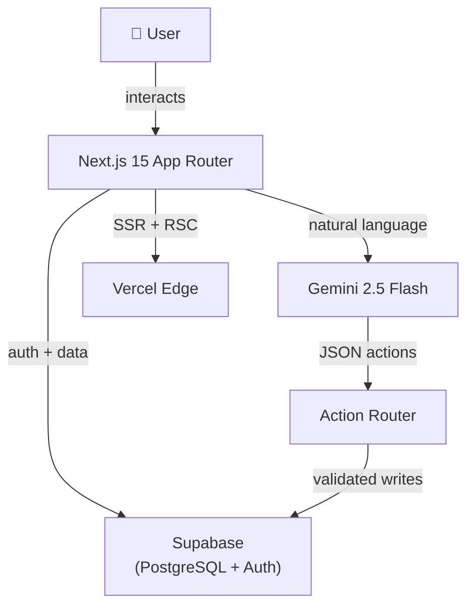

# Semua — Help you track, your everything.

> **Tagline:** Help you track, your everything.

Semua is a personal productivity SaaS that unifies task management, finance tracking, habit building, and goal setting into a single intelligent dashboard — powered by a Gemini AI Action Agent that lets you manage everything through natural language.

---

## Table of Contents

- [What is Semua?](#what-is-semua)
- [Who is it for?](#who-is-it-for)
- [Core Philosophy](#core-philosophy)
- [Project Status](#project-status)
- [Technology Stack](#technology-stack)
- [Architecture Overview](#architecture-overview)
- [Wiki Pages](#wiki-pages)

---

## What is Semua?

**Semua** (Malay for *"everything"*) is an all-in-one personal productivity platform. Instead of switching between a to-do app, a budgeting spreadsheet, a habit tracker, and a goal board, Semua brings all four into one beautifully designed dashboard.

The product has two modes of interaction:

1. **Manual UI** — Clean, card-based pages for tasks, finance, habits, and goals.
2. **AI Agent** — A natural language interface powered by Gemini 2.5 Flash that understands commands like *"Add lunch expense RM15"* or *"Mark my gym habit done today"* and executes them directly against your data.

---

## Who is it for?

| User | Why Semua |
|------|-----------|
| Students | Track assignments, spending, and study habits in one place |
| Freelancers | Manage client tasks, invoice income/expenses, and daily goals |
| Professionals | Daily focus, financial visibility, and habit accountability |
| Anyone | Who wants one app instead of four |

---

## Core Philosophy

- **Everything in one place.** Switching apps destroys focus. Semua is the last tab you need open.
- **Natural language first.** The fastest way to log data is to just say it. The AI Agent removes all friction.
- **Privacy by default.** All data is owned by the user. No third-party analytics, no selling data.
- **Simplicity over features.** Every feature earns its place. The UI stays clean.

---

## Project Status

| Area | Status |
|------|--------|
| Dashboard | ✅ Live |
| Task Tracker | ✅ Live |
| Finance Tracker | ✅ Live |
| Habit Tracker | ✅ Live |
| Goal Tracker | ✅ Live |
| AI Agent (Gemini) | ✅ Live |
| Quick Add Command Bar | ✅ Live |
| Authentication | ✅ Live |
| Mobile Responsive | 🔄 Partial |
| Dark Mode | 📋 Planned |
| Team Workspaces | 📋 v3.0 |

---

## Technology Stack

| Layer | Technology |
|-------|-----------|
| Framework | Next.js 15+ (App Router, Turbopack) |
| Language | TypeScript |
| Styling | Tailwind CSS v4 |
| UI Components | shadcn/ui |
| Animation | Framer Motion |
| Database | Supabase (PostgreSQL) |
| Auth | Supabase Auth |
| Server State | TanStack Query v5 |
| AI | Google Gemini 2.5 Flash (`@google/genai`) |
| Deployment | Vercel |
| Toast Notifications | Sonner |
| Charts | Recharts |
| Date Utilities | date-fns |

---

## Architecture Overview

---

## Wiki Pages

| Page | Description |
|------|-------------|
| [Product Roadmap](Product-Roadmap) | MVP status, version roadmap, feature checklist |
| [Architecture](Architecture) | System design, data flow, Mermaid diagrams |
| [Database](Database) | Tables, columns, RLS, ER diagram |
| [Authentication](Authentication) | Supabase Auth, protected routes, sessions |
| [Dashboard](Dashboard) | Layout, widgets, insights, philosophy |
| [Trackers](Trackers) | Tasks, Finance, Habits, Goals — full documentation |
| [AI Assistant](AI-Assistant) | Gemini integration, Action Router, prompt design |
| [API](API) | All API routes, request/response, errors |
| [Folder Structure](Folder-Structure) | Repository layout explained |
| [UI Design System](UI-Design-System) | Typography, colors, components, animations |
| [Security](Security) | RLS, env vars, rate limiting, best practices |
| [Deployment](Deployment) | Local setup, Vercel, environment variables |
| [Contributing](Contributing) | Branch naming, commits, PR process |
| [Changelog](Changelog) | Release history, versions, breaking changes |
