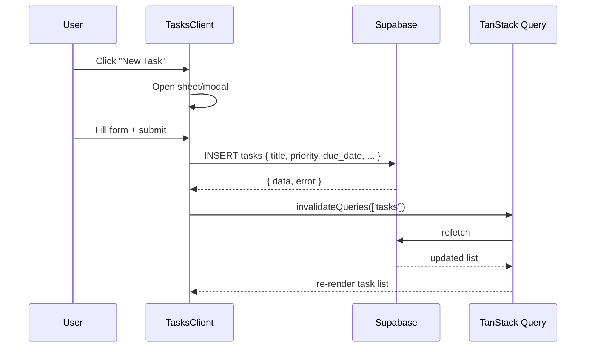
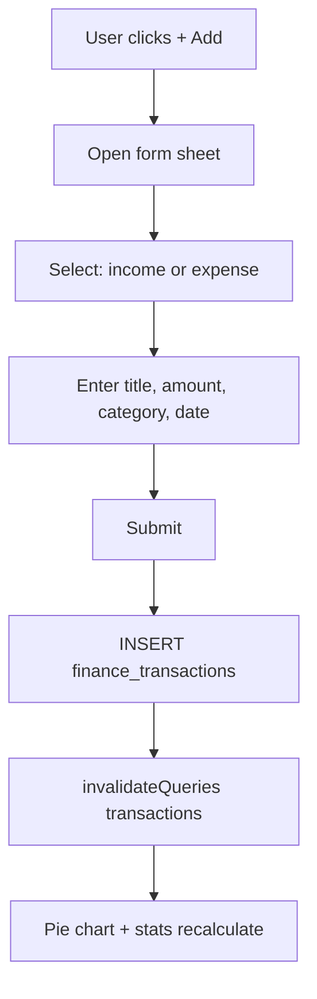
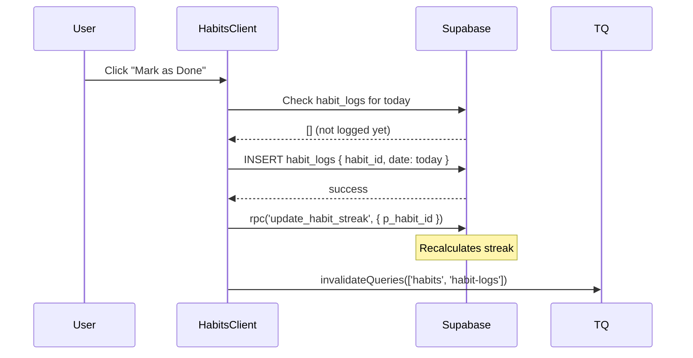

# Trackers

> Four productivity trackers: Tasks, Finance, Habits, Goals.

**→ [Home](Home) · [Database](Database) · [Dashboard](Dashboard) · [AI Assistant](AI-Assistant)**

---

## Table of Contents

- [Task Tracker](#task-tracker)
- [Finance Tracker](#finance-tracker)
- [Habit Tracker](#habit-tracker)
- [Goal Tracker](#goal-tracker)

---

## Task Tracker

### Purpose

Manage everything you need to do — with priority levels, due dates, and categories — organized by urgency.

### Features

| Feature | Detail |
|---------|--------|
| Create tasks | Title, priority, due date, category |
| Priority levels | low / medium / high / urgent |
| Status | todo / in-progress / completed |
| Due dates | Optional, displayed as `yyyy-MM-dd` |
| Grouped view | Overdue → Today → Upcoming → Completed |
| Search | Real-time filter by title |
| Edit / Delete | Inline, on hover |

### CRUD Flow



### Overdue Detection

Overdue is computed client-side, not stored:

```typescript
const isOverdue = (task: Task) =>
  task.due_date !== null &&
  isPast(parseISO(task.due_date)) &&
  !isToday(parseISO(task.due_date)) &&
  task.status !== 'completed'
```

> Uses `parseISO` (not `new Date()`) to avoid UTC midnight shift bug on non-UTC systems.

### Grouped Sections

```typescript
const overdue   = filtered.filter(isOverdue)
const today     = filtered.filter(t => t.due_date === todayStr && !isOverdue(t))
const upcoming  = filtered.filter(t => t.due_date && t.due_date > todayStr)
const completed = filtered.filter(t => t.status === 'completed')
```

### Key File

`src/app/(dashboard)/tasks/tasks-client.tsx`

### Future Ideas

- Recurring tasks (daily/weekly/monthly)
- Sub-tasks (nested hierarchy)
- Task dependencies
- Calendar view
- Bulk actions (complete all today)

---

## Finance Tracker

### Purpose

Track income and expenses with category breakdowns and monthly summaries. Answer: *"Where is my money going?"*

### Features

| Feature | Detail |
|---------|--------|
| Log income | Title, amount, category, date |
| Log expense | Title, amount, category, date |
| Month selector | Browse any month |
| Stat cards | Income, Expenses, Net balance |
| Amber insight | Top spending category highlighted |
| Pie chart | Expense breakdown by category |
| Search + filter | By title or category |
| Edit / Delete | On hover |

### CRUD Flow



### Month Filtering

```typescript
const monthStart = format(startOfMonth(selectedMonth), 'yyyy-MM-dd')
const monthEnd   = format(endOfMonth(selectedMonth),   'yyyy-MM-dd')

const monthlyTx = transactions.filter(t =>
  t.date >= monthStart && t.date <= monthEnd
)
```

> String comparison is used for date filtering — avoids timezone issues with `Date` objects.

### Pie Chart

Built with Recharts `PieChart`. Categories are derived dynamically from expense transactions in the current month.

```typescript
const pieData = Object.entries(expensesByCategory).map(([name, value]) => ({
  name,
  value,
}))
```

### Key File

`src/app/(dashboard)/finance/finance-client.tsx`

### Future Ideas

- Monthly budgets per category with alerts
- Recurring transactions
- CSV/Excel export
- Income vs expense trend line chart
- Savings rate calculator
- Split transactions

---

## Habit Tracker

### Purpose

Build lasting habits through daily logging and streak visualization. *"What you track, you improve."*

### Features

| Feature | Detail |
|---------|--------|
| Create habits | Name, emoji, frequency (daily/weekly) |
| Log completion | Mark today's habit as done |
| Streak tracking | Current streak + longest streak |
| 7-day grid | Visual completion grid |
| Emoji picker | Quick emoji selection |
| Edit / Delete | Inline |

### Completion Flow



### Duplicate Prevention

```typescript
const { data: existing } = await supabase
  .from('habit_logs')
  .select('id')
  .eq('habit_id', habitId)
  .eq('date', today)
  .limit(1)

if (existing?.length) return // already done today
```

### Streak Calculation

Handled by the `update_habit_streak` PostgreSQL RPC function. The client wraps it in `try/catch` since the RPC is non-fatal:

```typescript
try {
  await supabase.rpc('update_habit_streak', { p_habit_id: habitId })
} catch {
  // Non-critical — streak will recalculate next time
}
```

### Key File

`src/app/(dashboard)/habits/habits-client.tsx`

### Future Ideas

- Habit streaks milestones (badges at 7, 30, 100 days)
- Habit difficulty levels
- Weekly habits (not just daily)
- Missed-day forgiveness (allow one skip per week)
- Habit analytics page
- Habit templates library

---

## Goal Tracker

### Purpose

Track long-term objectives with measurable progress toward a numeric target.

### Features

| Feature | Detail |
|---------|--------|
| Create goals | Title, target value, deadline, category |
| Update progress | Enter current progress value |
| Completion | Auto-completed when progress >= target |
| Progress bar | Visual representation |
| Categories | Health, Learning, Finance, Career, etc. |
| Edit / Delete | Inline |

### Progress Flow

```typescript
const handleProgressUpdate = async (goalId: string, progress: number) => {
  const updates: Partial<Goal> = { current_progress: progress }
  if (progress >= goal.target) updates.status = 'completed'

  await supabase.from('goals').update(updates).eq('id', goalId)
}
```

### Progress Bar Calculation

```typescript
const pct = Math.round((goal.current_progress / goal.target) * 100)
// Clamped to 0–100 for display
const displayPct = Math.min(pct, 100)
```

### Deadline Display

```typescript
// Uses parseISO to avoid UTC midnight shift
const deadline = parseISO(goal.deadline)
const daysLeft = differenceInDays(deadline, new Date())
```

### Key File

`src/app/(dashboard)/goals/goals-client.tsx`

### Future Ideas

- Goal milestones (intermediate checkpoints)
- Link habits to goals ("Gym habit → Fitness goal")
- Goal templates
- Sharing goals publicly
- Goal streaks (consecutive days of progress)
- AI-suggested target values

---

*See also: [Database](Database) · [AI Assistant](AI-Assistant) · [Dashboard](Dashboard)*
